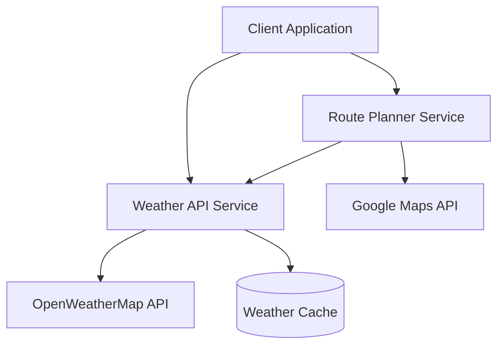

# Weather Service Project

A microservices-based weather and route planning application that provides weather forecasts along travel routes.

## Architecture

### System Components



### Services

1. **Weather API Service** (C# / .NET)
   - Provides weather forecasts for specific locations
   - Caches weather data to minimize external API calls
   - Exposes RESTful endpoints for weather queries
   - Interfaces with OpenWeatherMap API

2. **Route Planner Service** (Python / Flask)
   - Calculates routes between locations using Google Maps API
   - Fetches weather data for points along the route
   - Provides consolidated route and weather information
   - Uses Gunicorn for production deployment

### Technology Stack

- **Backend Services**:
  - Weather API: .NET 8.0
  - Route Planner: Python 3.12, Flask, Gunicorn
- **APIs**:
  - OpenWeatherMap API for weather data
  - Google Maps API for route planning
- **Container Runtime**: Docker
- **Container Registry**: GitHub Container Registry (ghcr.io)
- **Orchestration**: Kubernetes
- **Cloud Platform**: Oracle Cloud Infrastructure (OCI)
- **CI/CD**: GitHub Actions

## Local Development Setup

### Prerequisites

- Docker Desktop
- .NET 8.0 SDK
- Python 3.12
- Git

### Environment Variables

Create a `.env` file in the root directory:

```env
OPENWEATHERMAP_API_KEY=your_api_key
GOOGLE_MAPS_API_KEY=your_api_key
```

### Running Locally with Docker

1. **Build and Run Weather API**:
   ```bash
   cd api
   docker build -t weatherservice .
   docker run -p 80:80 -e OPENWEATHERMAP_API_KEY=your_key weatherservice
   ```

2. **Build and Run Route Planner**:
   ```bash
   cd route-weather-planner
   docker build -t route-planner .
   docker run -p 5000:5000 -e GOOGLE_MAPS_API_KEY=your_key route-planner
   ```

### Running Locally without Docker

1. **Start Weather API**:
   ```bash
   cd api
   dotnet restore
   dotnet run
   ```

2. **Start Route Planner**:
   ```bash
   cd route-weather-planner
   python -m venv venv
   source venv/bin/activate  # or `venv\Scripts\activate` on Windows
   pip install -r requirements.txt
   python app.py
   ```

## Oracle Cloud Deployment

### Prerequisites

1. Oracle Cloud Infrastructure (OCI) Account
2. OCI CLI installed and configured
3. GitHub Account with repository access
4. Kubernetes cluster created in OCI

### Required Secrets

Set up the following secrets in your GitHub repository:

```yaml
# OCI Authentication
OCI_CLI_USER: your_oci_user_ocid
OCI_CLI_TENANCY: your_tenancy_ocid
OCI_CLI_FINGERPRINT: your_api_key_fingerprint
OCI_PRIVATE_KEY: your_oci_private_key
OCI_REGION: your_oci_region
OCI_CLUSTER_ID: your_cluster_ocid

# API Keys
OPENWEATHERMAP_API_KEY: your_openweathermap_api_key
GOOGLE_MAPS_API_KEY: your_google_maps_api_key

# GitHub Container Registry
GITHUB_TOKEN: your_github_pat
```

### Deployment Steps

1. **Configure OCI CLI**:
   ```bash
   oci setup config
   ```

2. **Get Kubernetes Configuration**:
   ```bash
   oci ce cluster create-kubeconfig \
     --cluster-id $OCI_CLUSTER_ID \
     --file $HOME/.kube/config \
     --region $OCI_REGION \
     --token-version 2.0.0
   ```

3. **Deploy Using GitHub Actions**:
   - Push changes to the `main` branch
   - GitHub Actions will automatically:
     - Build Docker images
     - Push to GitHub Container Registry
     - Deploy to OCI Kubernetes cluster

### Manual Deployment

1. **Create Kubernetes Secrets**:
   ```bash
   # Create GitHub Container Registry secret
   kubectl create secret docker-registry ghcr-secret \
     --docker-server=ghcr.io \
     --docker-username=$GITHUB_USERNAME \
     --docker-password=$GITHUB_TOKEN

   # Create application secrets
   kubectl create secret generic weatherservice-secrets \
     --from-literal=OPENWEATHERMAP_API_KEY=$OPENWEATHERMAP_API_KEY \
     --from-literal=GOOGLE_MAPS_API_KEY=$GOOGLE_MAPS_API_KEY
   ```

2. **Deploy Services**:
   ```bash
   kubectl apply -f k8s/
   ```

3. **Verify Deployment**:
   ```bash
   kubectl get pods -l app=weatherservice
   kubectl get services -l app=weatherservice
   ```

## API Documentation

### Weather API Endpoints

- `GET /weather/{zipcode}`
  - Returns current weather for the specified ZIP code
  - Response includes temperature, conditions, and forecast

- `GET /weather/coordinates/{lat}/{lon}`
  - Returns weather data for specific coordinates
  - Used by the route planner service

### Route Planner Endpoints

- `POST /get_route_weather`
  - Request body: `{ "origin": "address1", "destination": "address2" }`
  - Returns route information with weather data at key points

## Monitoring and Maintenance

### Health Checks

- Weather API: `GET /health`
- Route Planner: `GET /health`

### Logs

```bash
# View Weather API logs
kubectl logs -l app=weatherservice,component=api

# View Route Planner logs
kubectl logs -l app=weatherservice,component=route-planner
```

### Scaling

```bash
# Scale route planner service
kubectl scale deployment route-planner --replicas=3

# Scale weather API service
kubectl scale deployment weather-api --replicas=3
```

## Contributing

1. Fork the repository
2. Create a feature branch
3. Commit your changes
4. Push to the branch
5. Create a Pull Request

## License

This project is licensed under the MIT License - see the LICENSE file for details.
