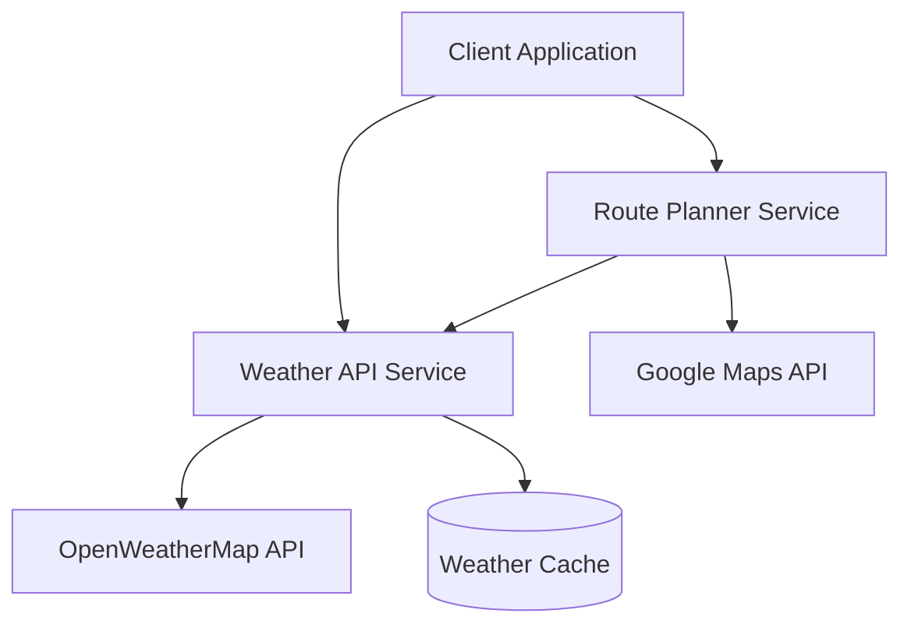

# Weather Service Project

A microservices-based weather and route planning application that provides weather forecasts along travel routes.

## Architecture

### System Components



### Services

1. **Weather API Service** (C# / .NET)
   - Provides weather forecasts for specific locations
   - Caches weather data to minimize external API calls
   - Exposes RESTful endpoints for weather queries
   - Interfaces with OpenWeatherMap API

2. **Route Planner Service** (Python / Flask)
   - Calculates routes between locations using Google Maps API
   - Fetches weather data for points along the route
   - Provides consolidated route and weather information
   - Integrates real-time NOAA radar imagery from Iowa State University's MESONET service
   - Uses Gunicorn for production deployment

### Technology Stack

- **Backend Services**:
  - Weather API: .NET 8.0
  - Route Planner: Python 3.12, Flask, Gunicorn
- **APIs**:
  - OpenWeatherMap API for weather data
  - Google Maps API for route planning
  - NOAA radar data via Iowa State University's MESONET service (no API key required)
- **Container Runtime**: Docker
- **Container Registry**: GitHub Container Registry (ghcr.io)
- **Orchestration**: Kubernetes
- **Cloud Platform**: Oracle Cloud Infrastructure (OCI)
- **CI/CD**: GitHub Actions

## Local Development Setup

### Prerequisites

- Docker Desktop
- .NET 8.0 SDK
- Python 3.12
- Git

### Environment Variables

Create a `.env` file in the root directory:

```env
OPENWEATHERMAP_API_KEY=your_api_key
GOOGLE_MAPS_API_KEY=your_api_key
```

### Running Locally with Docker

1. **Build and Run Weather API**:
   ```bash
   cd api
   docker build -t weatherservice .
   docker run -p 80:80 -e OPENWEATHERMAP_API_KEY=your_key weatherservice
   ```

2. **Build and Run Route Planner**:
   ```bash
   cd route-weather-planner
   docker build -t route-planner .
   docker run -p 5000:5000 -e GOOGLE_MAPS_API_KEY=your_key route-planner
   ```

### Running Locally without Docker

1. **Start Weather API**:
   ```bash
   cd api
   dotnet restore
   dotnet run
   ```

2. **Start Route Planner**:
   ```bash
   cd route-weather-planner
   python -m venv venv
   source venv/bin/activate  # or `venv\Scripts\activate` on Windows
   pip install -r requirements.txt
   python app.py
   ```

## Oracle Cloud Deployment

### Prerequisites

1. Oracle Cloud Infrastructure (OCI) Account
2. OCI CLI installed and configured
3. GitHub Account with repository access
4. Kubernetes cluster created in OCI

### Testing Oracle Cloud Connectivity

To verify your GitHub Actions integration with Oracle Cloud, you can use the test workflow provided:

1. Make sure all required OCI secrets are configured (see below)
2. Go to the Actions tab in your repository
3. Run the "Test Oracle Cloud Connectivity" workflow
4. Check the results to ensure authentication works properly

For detailed instructions, see [Oracle Cloud Connection Test](docs/oci-connection-test.md).

### Required Secrets

Set up the following secrets in your GitHub repository:

```yaml
# OCI Authentication
OCI_CLI_USER: your_oci_user_ocid
OCI_CLI_TENANCY: your_tenancy_ocid
OCI_CLI_FINGERPRINT: your_api_key_fingerprint
OCI_PRIVATE_KEY: your_oci_private_key
OCI_REGION: your_oci_region
OCI_CLUSTER_ID: your_cluster_ocid

# API Keys
OPENWEATHERMAP_API_KEY: your_openweathermap_api_key
GOOGLE_MAPS_API_KEY: your_google_maps_api_key

# GitHub Container Registry
GITHUB_TOKEN: your_github_pat
```

### Deployment Steps

1. **Configure OCI CLI**:
   ```bash
   oci setup config
   ```

2. **Get Kubernetes Configuration**:
   ```bash
   oci ce cluster create-kubeconfig \
     --cluster-id $OCI_CLUSTER_ID \
     --file $HOME/.kube/config \
     --region $OCI_REGION \
     --token-version 2.0.0
   ```

3. **Deploy Using GitHub Actions**:
   - Push changes to the `main` branch
   - GitHub Actions will automatically:
     - Build Docker images
     - Push to GitHub Container Registry
     - Deploy to OCI Kubernetes cluster

### Manual Deployment

1. **Create Kubernetes Secrets**:
   ```bash
   # Create GitHub Container Registry secret
   kubectl create secret docker-registry ghcr-secret \
     --docker-server=ghcr.io \
     --docker-username=$GITHUB_USERNAME \
     --docker-password=$GITHUB_TOKEN

   # Create application secrets
   kubectl create secret generic weatherservice-secrets \
     --from-literal=OPENWEATHERMAP_API_KEY=$OPENWEATHERMAP_API_KEY \
     --from-literal=GOOGLE_MAPS_API_KEY=$GOOGLE_MAPS_API_KEY
   ```

2. **Deploy Services**:
   ```bash
   kubectl apply -f k8s/
   ```

3. **Verify Deployment**:
   ```bash
   kubectl get pods -l app=weatherservice
   kubectl get services -l app=weatherservice
   ```

## API Documentation

### Weather API Endpoints

- `GET /weather/{zipcode}`
  - Returns current weather for the specified ZIP code
  - Response includes temperature, conditions, and forecast

- `GET /weather/coordinates/{lat}/{lon}`
  - Returns weather data for specific coordinates
  - Used by the route planner service

### Route Planner Endpoints

- `POST /get_route_weather`
  - Request body: `{ "origin": "address1", "destination": "address2" }`
  - Returns route information with weather data at key points

## Monitoring and Maintenance

### Health Checks

- Weather API: `GET /health`
- Route Planner: `GET /health`

### Logs

#### Accessing Logs

#### Local Development Logs

1. **Docker Container Logs**:
   ```bash
   # Follow logs for Weather API container
   docker logs -f weatherservice

   # Follow logs for Route Planner container
   docker logs -f route-planner

   # Get last 100 lines of logs
   docker logs --tail=100 weatherservice
   ```

2. **Local Development Server Logs**:
   - Weather API (.NET):
     ```bash
     # Logs are written to console and debug output
     dotnet run
     ```
   - Route Planner (Flask):
     ```bash
     # Development server logs
     python app.py
     ```

#### Production Logs (Oracle Cloud Kubernetes)

1. **Pod Logs**:
   ```bash
   # Get logs from Weather API pods
   kubectl logs -l app=weatherservice,component=api --tail=50 --follow

   # Get logs from Route Planner pods
   kubectl logs -l app=weatherservice,component=route-planner --tail=50 --follow

   # Get logs from a specific pod
   kubectl logs <pod-name> --tail=50 --follow
   ```

2. **Application-Specific Logs**:
   - Weather API Service:
     ```bash
     # Get logs with specific log level
     kubectl logs -l component=api --tail=100 | grep "ERROR"
     kubectl logs -l component=api --tail=100 | grep "WARNING"
     ```
   - Route Planner Service:
     ```bash
     # Access Gunicorn access logs
     kubectl logs -l component=route-planner | grep "GET\|POST"

     # Access Gunicorn error logs
     kubectl logs -l component=route-planner | grep "ERROR"
     ```

3. **Previous Container Logs**:
   ```bash
   # If a container has restarted, get previous container logs
   kubectl logs <pod-name> --previous
   ```

### Log Types and Formats

1. **Weather API Logs**:
   - Format: JSON structured logging
   - Fields:
     ```json
     {
       "timestamp": "2025-05-12T04:12:04.123Z",
       "level": "Information",
       "message": "Request processed",
       "endpoint": "/weather/48045",
       "duration_ms": 123,
       "status_code": 200
     }
     ```

2. **Route Planner Logs**:
   - Gunicorn Access Logs:
     ```
     172.19.0.1 - - [12/May/2025 04:12:04] "GET / HTTP/1.1" 200 -
     ```
   - Application Logs:
     ```
     [2025-05-12 04:12:04,123] INFO: Route calculation completed
     ```

### Log Retention and Management

1. **Container Runtime**:
   - Docker: Logs retained until container removal
   - Command to clear logs:
     ```bash
     docker system prune
     ```

2. **Kubernetes**:
   - Default retention: Based on container runtime configuration
   - Pod logs persist until pod deletion
   - Previous container logs available for debugging

### Monitoring Log Output

1. **Real-time Monitoring**:
   ```bash
   # Watch for errors in all services
   kubectl logs -l app=weatherservice --all-containers --tail=1 -f | grep "ERROR"
   ```

2. **Health Check Logs**:
   ```bash
   # Monitor health check endpoints
   kubectl logs -l app=weatherservice --tail=50 | grep "health"
   ```

### Log Analysis Tips

1. **Common Debugging Patterns**:
   ```bash
   # Find failed requests
   kubectl logs -l app=weatherservice | grep "status_code=5"

   # Track API latency
   kubectl logs -l component=api | grep "duration_ms" | sort -n -k2
   ```

2. **Performance Analysis**:
   ```bash
   # Monitor route calculation times
   kubectl logs -l component=route-planner | grep "calculation_time"

   # Track weather API response times
   kubectl logs -l component=api | grep "api_response_time"
   ```

### Log Aggregation

For production environments, logs are:
- Written to stdout/stderr (container standard)
- Collected by Kubernetes
- Accessible via kubectl
- Retained based on pod lifecycle
- Available for external log aggregation systems

## Scaling

```bash
# Scale route planner service
kubectl scale deployment route-planner --replicas=3

# Scale weather API service
kubectl scale deployment weather-api --replicas=3
```

## Contributing

1. Fork the repository
2. Create a feature branch
3. Commit your changes
4. Push to the branch
5. Create a Pull Request

## License

This project is licensed under the MIT License - see the LICENSE file for details.

## Technologies Used

### Container Technologies

#### Docker
- **Version**: Latest
- **Purpose**: Application containerization
- **Components**:
  - Dockerfile for Weather API (.NET)
  - Dockerfile for Route Planner (Python)
- **Features Used**:
  - Multi-stage builds for optimized images
  - Environment variable injection
  - Volume mounting for development
  - Multi-architecture support (AMD64/ARM64)

#### Kubernetes (OKE - Oracle Container Engine)
- **Version**: Latest supported by OKE
- **Features Used**:
  - Deployments for rolling updates
  - Services for load balancing
  - Secrets management
  - Health checks and probes
  - Resource management
  - Horizontal scaling
  - Container registry integration

### Cloud Services

#### Oracle Cloud Infrastructure (OCI)
- **Components Used**:
  - Oracle Container Engine for Kubernetes (OKE)
  - Virtual Cloud Network (VCN)
  - Load Balancers
  - Container Registry
  - Identity and Access Management (IAM)
- **Features**:
  - High availability configuration
  - Auto-scaling
  - Regional deployment
  - Secure network policies

### External APIs

#### Google Maps API
- **Services Used**:
  - Directions API
  - Geocoding API
  - Distance Matrix API
- **Features**:
  - Route calculation
  - Address geocoding
  - Distance and duration estimation
  - Waypoint optimization

#### OpenWeatherMap API
- **Endpoints Used**:
  - Current Weather Data
  - 5 Day / 3 Hour Forecast
  - Geocoding API
- **Features**:
  - Real-time weather data
  - Temperature and conditions
  - Location-based forecasts
  - Coordinate-based queries

### Development Tools

#### GitHub Actions (CI/CD)
- **Features Used**:
  - Automated builds
  - Multi-platform container builds
  - Automated testing
  - Deployment automation
  - Secret management
  - Environment management

#### Development IDEs and Tools
- **Visual Studio 2022**
  - C# development
  - Docker integration
  - Kubernetes tools
- **Visual Studio Code**
  - Python development
  - Remote container development
  - Kubernetes extension
  - Docker extension

### Programming Languages and Frameworks

#### C# / .NET 8.0
- **Features Used**:
  - ASP.NET Core Web API
  - Dependency Injection
  - Configuration Management
  - HTTP Client Factory
  - Memory Caching
  - Health Checks
  - Logging

#### Python 3.12
- **Frameworks**:
  - Flask for REST API
  - Gunicorn for WSGI server
  - Requests for HTTP clients
  - Python-dotenv for configuration
  - Circuit breaker pattern implementation
- **Features**:
  - Async/await support
  - Type hints
  - Environment management
  - Error handling

### Networking

#### Ingress and Load Balancing
- **Components**:
  - Kubernetes Services (LoadBalancer type)
  - OCI Load Balancers
  - Internal service discovery
- **Features**:
  - SSL/TLS termination
  - Path-based routing
  - Health monitoring
  - Load distribution

#### Security
- **Implementations**:
  - Container security
  - Network policies
  - Secret management
  - API authentication
  - HTTPS enforcement
  - Rate limiting

### Monitoring and Logging

#### Application Monitoring
- **Features**:
  - Health check endpoints
  - Kubernetes liveness probes
  - Readiness probes
  - Resource monitoring
  - Performance metrics

#### Logging
- **Implementation**:
  - Structured logging
  - Container logs
  - Kubernetes events
  - Application-level logging
  - Error tracking

### Version Control

#### Git
- **Features Used**:
  - Branch protection
  - Pull request workflows
  - Semantic versioning
  - Automated tagging
  - Release management

### WSGI Server Configuration

#### Gunicorn (Green Unicorn)
The Route Planner service uses Gunicorn as its production WSGI (Web Server Gateway Interface) server instead of Flask's built-in development server. Here's why and how it's configured:

```yaml
command:
- gunicorn
args:
- --workers=4
- --bind=0.0.0.0:5000
- --access-logfile=-
- --error-logfile=-
- --log-level=info
- --preload
- wsgi:app
```

**Why Gunicorn?**
- Production-grade WSGI HTTP Server for Python
- Better performance and stability than Flask's development server
- Process management and monitoring
- Automatic worker process management
- Proper handling of concurrent requests

**Configuration Explained**:
- `--workers=4`: Uses 4 worker processes
  - Calculated based on: CPU cores * 2 + 1
  - Balances CPU usage and memory consumption
  - Provides redundancy and request handling capacity

- `--bind=0.0.0.0:5000`: Network binding
  - Listens on all network interfaces
  - Port 5000 matches container configuration
  - Allows Kubernetes service discovery

- `--access-logfile=- and --error-logfile=-`: Logging configuration
  - Outputs to stdout/stderr
  - Integrates with container logging
  - Enables log collection by Kubernetes

- `--log-level=info`: Logging detail
  - Provides operational visibility
  - Balances information and performance
  - Helps with troubleshooting

- `--preload`: Application loading
  - Loads application code before forking
  - Reduces memory usage
  - Catches syntax errors early
  - Ensures consistent application state

- `wsgi:app`: Application entry point
  - Points to the WSGI callable in wsgi.py
  - Standard Python WSGI interface
  - Separates application and server concerns

**Benefits of This Configuration**:
1. **Performance**:
   - Multiple workers handle concurrent requests
   - Pre-loading reduces memory footprint
   - Efficient process management

2. **Reliability**:
   - Worker management and recovery
   - Process isolation
   - Graceful reload capability

3. **Monitoring**:
   - Detailed access and error logs
   - Process status information
   - Health check capability

4. **Security**:
   - Process isolation
   - No development server vulnerabilities
   - Proper production configuration

5. **Container Integration**:
   - Proper signal handling
   - Container-friendly logging
   - Clean process management

This configuration provides a robust, production-ready environment for the Flask application while maintaining good performance and reliability characteristics.
